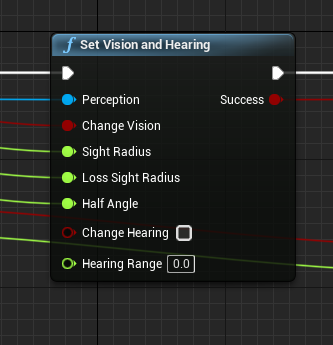
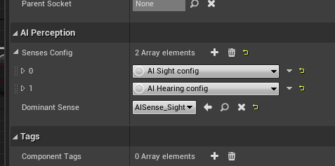

# AITools

This lets you change AIPerception component values for Sight and Hearing using a simple blueprint node.
Supported Version 4.25. But you can auto compile to any version as source is included.

### Installation
1. Extract the Plugins folder in your project root directory
2. Enable AITools in plugins list (You need to restart UE4)
3. Access node in blueprint

Before using this please make sure that you have initial Sight and Hearing present

### License
[CC 1.0] 

**Free Software, Hell Yeah!**

   [CC 1.0]: <https://creativecommons.org/licenses/by/1.0>
